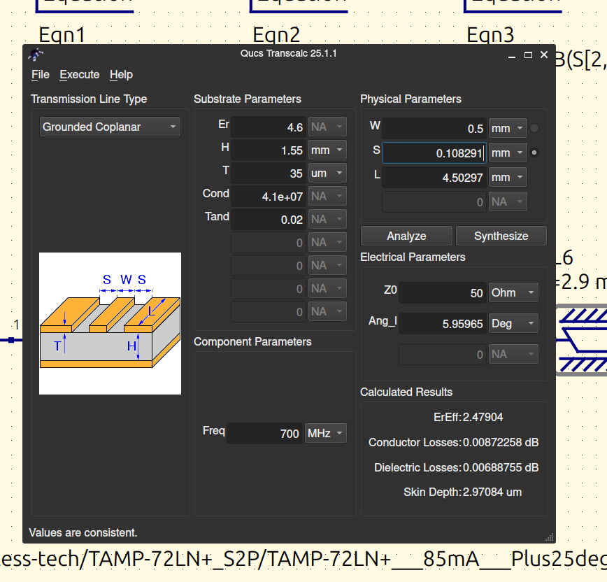
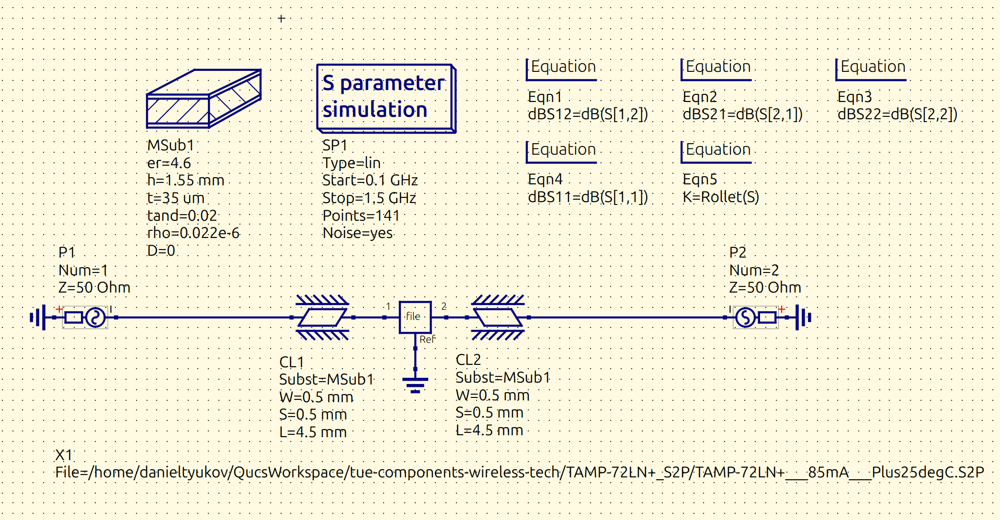
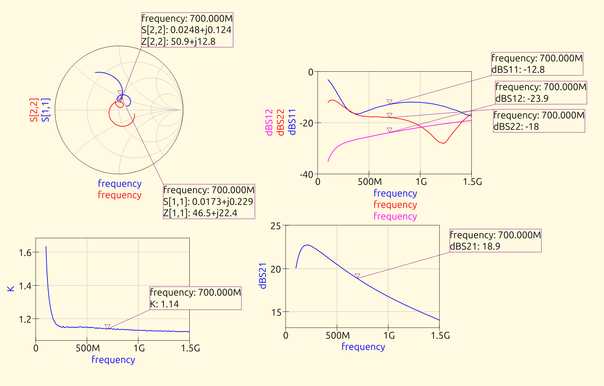

# Components in Wireless Technologies (5XTC0), TU/e

Lab work for the Components in Wireless Technologies course (course code 5XTC0) in the
Electrical Engineering programme at Eindhoven University of Technology (TU/e). The labs
cover RF and microwave passive and active components: transmission-line matching, a dipole
antenna, and a low-noise amplifier. The workflow runs from QUCS-S circuit simulation, to
CST full-wave antenna simulation, to bench measurement with a NanoVNA, with the resulting
S-parameters processed and plotted in MATLAB. Each lab has a written report PDF; the MATLAB
scripts, QUCS-S projects, Touchstone files, and inductor models sit alongside them.

## Lab 1: QUCS circuit simulation

Introduction to the QUCS-S simulator through transmission-line loads. The exercises drive
different terminations (for example a short-circuit load on a 50 ohm line) and read off the
reflection coefficient, checking the simulated result against the analytical
`Gamma = (Z_L - Z_0) / (Z_L + Z_0)`. The Murata LQW18 series inductor SPICE models
(`LQW18*.mod`) are the components used in the schematics.

Files: `5xtc0-lab1-qucs-s_prj/` (schematics and data displays), `5XTC0 - LAB1 ...pdf`.

## Lab 2: quarter-wave stub matching

A quarter-wave stub built as a grounded coplanar waveguide near 50 ohm characteristic
impedance. The analysis loads the measured two-port data, computes S11 in magnitude and
phase, derives the input impedance from the reflection coefficient, and draws a Smith
chart. At 1 GHz the stub is a quarter wavelength and transforms the open termination to a
short on the main line, minimising reflection; at 500 MHz it is only an eighth of a
wavelength, so the match degrades and reflection rises. Simulated results are compared
against NanoVNA measurements.

Files: `quarter_wave_stub_analysis_lab2.m`, `quarter_wave_stub.s2p`, `5xtc0-lab2_prj/`,
`5XTC0 - LAB2 ...pdf`.

## Lab 3: dipole antenna

Measurement and simulation of a half-wave dipole around 1 GHz. The single-port scripts
compare the antenna in free space against the same antenna with a hand held nearby, showing
the return loss degrading from about -20 dB to -5 dB as the near-field environment detunes
the match, and reporting the fraction of power delivered `1 - |S11|^2`. The two-port script
measures coupling between two dipoles (S21 and S12) and estimates single-antenna gain from
the Friis equation at a known separation. The CST script sets the half-wave dimensions,
loads the exported Touchstone data, finds the resonant frequency and return loss, and draws
the Smith chart; the physical dipole was trimmed to 114 mm to bring resonance to 1 GHz.

Files: `dipole_analysis_port1_lab3.m`, `dipole_analysis_port12_lab3.m`,
`dipole_cst_analysis_lab3.m`, the `lab3_*.s1p` / `.s2p` files, the CST project
`Dipole_antenna_student (1 GHz)_2024.cst`, `5XTC0 - LAB3 ...pdf`.

## Lab 5: RF amplifier design in QUCS

Simulation of an RF low-noise amplifier (Mini-Circuits TAMP-72LN+) from its S-parameter
file. The schematic embeds the device in a microstrip environment with coupled lines, runs
a two-port S-parameter sweep, and computes the four S-parameters plus the Rollet stability
factor K, with markers placed at 700 MHz. The board was then redesigned and re-simulated.
At 700 MHz the redesign shows about 18.9 dB gain (S21), input and output reflection below
-12 dB, and K above 1, meaning the amplifier is unconditionally stable there.

Files: `5xtc0-lab5_prj/` (stand-alone amplifier and redesign schematics and data),
`5XTC0 - LAB5 ...pdf`.

## Lab 6: amplifier measurements

Bench characterisation of the amplifier board with a NanoVNA from 50 kHz to 1.5 GHz under
different bias conditions (unbiased, 1.4 V, and 5 V). The MATLAB script loads each
Touchstone measurement, converts S11, S21, S12, and S22 to dB, marks the values at 700 MHz,
and prints a summary table across the bias points. The swapped-port files carry the S22 and
S12 measurements taken with the device turned around.

Files: `amplifier_analysis_lab6.m`, the `lab6_amplifier_*.s2p` files, the
`TAMP-72LN+_S2P/` datasheet Touchstone set, `5XTC0 - LAB6 ...pdf`.

## Oral exam

`5XTC0_Components_Wireless_Tech_1819283_Oral_Exam_Presentation.pdf` summarises the antenna
and amplifier findings for the oral lab exam.

## Topics

- Transmission lines, reflection coefficient, and the Smith chart
- Impedance matching with quarter-wave and shorted stubs
- Coplanar waveguide and microstrip synthesis
- Dipole antennas: return loss, resonance, detuning, and Friis gain estimation
- S-parameters (S11, S21, S12, S22) and input impedance from reflection data
- RF amplifier gain and Rollet stability factor
- Amplifier biasing and its effect on S-parameters
- Simulation against measurement: QUCS-S, CST, and NanoVNA

## Running

The MATLAB scripts require the RF Toolbox for `sparameters`, `smithplot`, and related
functions. Put each script next to its Touchstone (`.s1p` / `.s2p`) files and run it. The
QUCS-S projects (`*_prj/`) open in QUCS-S; the antenna project opens in CST Studio Suite.

## Technologies

MATLAB (RF Toolbox), QUCS-S, CST Studio Suite, NanoVNA, Touchstone S-parameter files.
